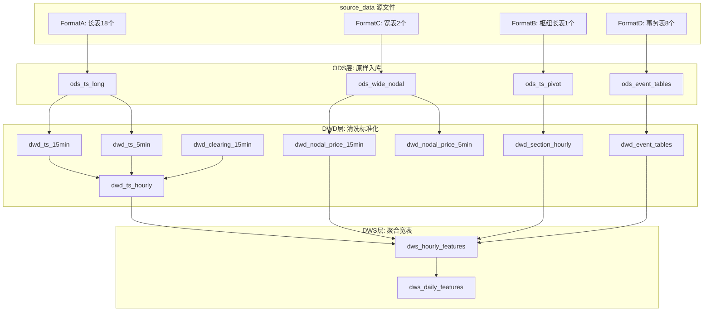

# 重庆电力市场数据入库方案（基于源数据实际内容重新设计）

> 基于对29个源数据文件的逐一深度检查，对照数据字典获取报告纠正理解偏差，重新设计分层入库方案（ODS/DWD/DWS），覆盖4种源数据格式、5种时间粒度、混合日期格式处理和大文件分块加载策略。

---

## 一、实际数据 vs 报告描述 — 关键纠正

### 1.1 格式差异：报告描述的是网页原始格式，源文件已被预处理

报告中描述的 `V0015~V2400` 宽表格式是**网页端的返回结构**。实际 `source_data/` 中的文件，大部分已被爬虫转换为长表（datetime + value 列），只有两个节点电价文件保留了原始宽表结构：

| 实际格式 | 涉及文件 |
| --- | --- |
| **A: 长表 (datetime, value)** | 实际负荷、系统负荷预测、发电总出力(预测)、水电总出力(预测)、非市场机组总出力(预测)、新能源总出力、新能源预测、新能源总出力预测、省间联络线输电、省间联络线输电曲线预测、日前出清结果、实时出清结果、日前可靠性出清、统一结算点电价、现货交易可靠性结果查询（用电侧）（共18个） |
| **B: 枢纽长表 (entity, ts, value)** | 断面约束(设备名称/设备类型/时点/值)（共1个） |
| **C: 原始宽表 (V-columns)** | 日前节点电价(100列)、实时节点电价(292列)（共2个） |
| **D: 事务/事件表** | 检修计划、绿电交易、滚动撮合、中长期合同、售电代理电量、日前/实时平均出清电价、平均申报电价（共8个） |

### 1.2 日期格式混乱（报告未提及）

| 文件 | 日期列 | 格式问题 |
| --- | --- | --- |
| 日前出清结果 | datetime | `2025/1/1 0:00` 而非 `2025-01-01 00:00:00` |
| 日前节点电价 | 日期 | 前304行 `YYYY-MM-DD`（占位空行），后面 `YYYYMMDD`（整数） |
| 统一结算点电价 | datetime | 早期行为纯日期 `2025-01-01`，后期为小时 `2025-05-01 00:00:00` |
| 实时节点电价 | 日期 | 前1046行 `YYYY-MM-DD`（占位空行），后面为 `YYYY-MM-DD` |

### 1.3 粒度差异（报告描述了网页粒度，源文件实际粒度不同）

| 文件 | 报告描述 | 实际粒度 | 日均行数 |
| --- | --- | --- | --- |
| 实际负荷等15min类 | 96点 V0015~V2400 | **已展开为15min行** | 96 |
| 省间联络线输电 | 288点 V0005~V2400 | **已展开为5min行** | 288 |
| 断面约束 | V0100~V2400 24点 | **已展开为1h行** | 每设备24 |
| 日前节点电价 | V0015~V2400 | **仍为宽表** 96列 | ~1134 |
| 实时节点电价 | V0005~V2400 | **仍为宽表** 288列 | ~1000+ |

### 1.4 有效数据范围（报告未准确反映）

| 文件 | 报告起始日 | 实际有效起始 | 备注 |
| --- | --- | --- | --- |
| 日前出清结果 | - | **2025-11-01** | 前10个月全空 |
| 日前节点电价 | 2025-11-01 | 2025-11-01 | 报告准确，但缺2026-01数据 |
| 实时节点电价 | 2025-03-10 | 2025-03-11 | V0005首个有效日差1天 |
| 统一结算点电价 | 2025-05-01 | 2025-05-01 | 2025-07~10空洞,2025-08仅48行实时 |
| 中长期合同 | 2026-01-01 | 2026-01-01 | 仅3个月 |
| 售电代理电量 | 2026-01-01 | 2026-01-01 | 仅3个月 |
| 滚动撮合 | 2026-01-03 | 2025-12-30交易日 | 仅~3个月 |

### 1.5 新能源总出力预测 — 格式已更新

**最新格式（2026-03 更新）**：已从旧版枢纽长表 `[数据类型, 类型, 时点, 值]` 变更为多列长表 `[datetime, 光伏总出力预测上午, 新能源总出力预测上午, 风电总出力预测上午, 光伏总出力预测下午, 新能源总出力预测下午, 风电总出力预测下午]`，与发电总出力预测等文件格式一致（Format A_DUAL），共 42,442 行（15分钟粒度）。旧版的 2025-03-02 双版本数据问题已不存在。

### 1.6 新增：现货交易可靠性结果查询（用电侧）

原标注为"源文件中无此文件"，现已新增。为15分钟长表 `[datetime, 日前加权平均节点电价(元/MWh), 实时加权平均节点电价(元/MWh)]`，共 43,488 行。有效数据从 2025-03 开始（2025-01~02 为空占位行）。

---

## 二、分层入库架构



---

## 三、ODS 层设计（原样入库，仅标准化列名和日期格式）

### 3.1 Format A: 长表时序（18个文件 → 分表）

建议分为3张 ODS 表，因粒度和列结构不同：

**`ods_ts_single_value`** — datetime + 单值列（9个文件）

- 实际负荷、系统负荷预测、发电总出力、水电总出力、非市场机组总出力、新能源总出力、新能源预测、省间联络线输电、现货交易可靠性结果查询（用电侧）
- 字段: `ts DateTime, metric LowCardinality(String), value Float64`
- 入库时统一 metric 名，如 `actual_load`, `load_forecast`, `total_generation`, `reliability_da_price`, `reliability_rt_price`, ...

**`ods_ts_dual_version`** — datetime + 上午/下午双值列（5个文件）

- 发电总出力预测、水电总出力预测、非市场机组总出力预测、新能源总出力预测、省间联络线输电曲线预测
- 字段: `ts DateTime, metric LowCardinality(String), version LowCardinality(String), value Float64`
- 入库时 melt 上午/下午为 version 列

**`ods_clearing`** — datetime + 出清三元组（3个文件 + 统一结算点电价）

- 日前出清结果(电价/电力/机组台数)、实时出清结果、日前可靠性出清
- 字段: `ts DateTime, market_type LowCardinality(String), price Nullable(Float64), power Nullable(Float64), unit_count Nullable(UInt16)`
- 统一结算点电价: `ts DateTime, da_price Nullable(Float64), rt_price Nullable(Float64)`

### 3.2 Format B: 枢纽长表（1个文件 → 1张表）

**`ods_section_constraint`**

- 字段: `ts DateTime, device_name String, device_type LowCardinality(String), value Float64`

### 3.3 Format C: 宽表（2个文件 → 2张表，入库时 melt 为长表）

**`ods_nodal_price_da`** — 日前节点电价

- 原始100列 → melt 为: `dt Date, node_type LowCardinality(String), data_type LowCardinality(String), node_name String, ts DateTime, price Float64`
- 入库时: 跳过前304行占位空行，解析 YYYYMMDD 日期，将 V0015~V2400 melt 为 ts（往前推15分钟）
- 大小: 约 144K 行 × 96 时点 = ~1380万条记录

**`ods_nodal_price_rt`** — 实时节点电价

- 原始292列 → melt 为相同结构但5min粒度
- 入库时: 跳过前1046行占位空行，将 V0005~V2400 melt 为 ts（往前推5分钟）
- 大小: 约 381K 行 × 288 时点 = 理论~1.1亿条（但非全满），需分块处理，每次 5000~10000 行

### 3.4 Format D: 事务表（8个文件 → 各自独立表）

- **`ods_maintenance_plan`**: dt, version, equipment_name, equipment_type, voltage_level, planned_start, planned_end
- **`ods_daily_price`**: dt, metric(da_avg/rt_avg/avg_bid), price（3文件合1表）
- **`ods_rolling_match`**: query_date, trade_date, round, slot, volume, highest_price, lowest_price, weighted_price, median_price
- **`ods_contract_decomposition`**: seller, seller_type, buyer, buyer_type, contract_name, start_date, end_date, decomp_date, daily_volume, ts, power_point, price_point
- **`ods_retail_volume`**: customer_id, is_additional, customer_name, meter_id, dt, slot, volume_kwh
- **`ods_green_power_trade`**: dt, trade_name, gen_count, retail_count, bid_volume, deal_gen_count, deal_retail_count, deal_volume, deal_avg_price

---

## 四、DWD 层设计（清洗+标准化+去空+去重）

### 4.1 清洗规则

| 规则 | 描述 |
| --- | --- |
| 去空行 | 删除所有值列全为 NULL 的占位行 |
| 日期标准化 | 统一为 `YYYY-MM-DD HH:MM:SS` 格式 |
| 异常标记 | 非市场机组出力 < -1000 标记为异常；出清电价 = 0 标记 |
| 单位换算 | 售电代理电量 kWh → MWh（÷1000） |

### 4.2 DWD 表

**`dwd_system_ts_15min`** — 系统级15分钟时序（合并 Format A 单值 + 双值）

- 字段: `ts DateTime, metric LowCardinality(String), version LowCardinality(String), value Float64, is_anomaly UInt8`
- metric 枚举:
  - `actual_load` (实际负荷)
  - `load_forecast` (系统负荷预测)
  - `total_gen` (发电总出力)
  - `total_gen_fcst` (发电总出力预测, version=am/pm)
  - `hydro_gen` (水电总出力)
  - `hydro_gen_fcst` (水电总出力预测, version=am/pm)
  - `non_market_gen` (非市场机组总出力)
  - `non_market_gen_fcst` (非市场机组总出力预测, version=am/pm)
  - `renewable_gen` (新能源总出力)
  - `renewable_fcst` (新能源预测 - 96点单值版)
  - `renewable_fcst_solar` (光伏预测, version=am/pm)
  - `renewable_fcst_wind` (风电预测, version=am/pm)
  - `renewable_fcst_total` (新能源汇总预测, version=am/pm)
  - `reliability_da_price` (日前加权平均节点电价)
  - `reliability_rt_price` (实时加权平均节点电价)
  - `tie_line_power` (省间联络线输电)
  - `tie_line_fcst` (省间联络线输电曲线预测, version=am/pm)

**`dwd_clearing_15min`** — 出清结果

- 字段: `ts DateTime, market LowCardinality(String), price Nullable(Float64), power Nullable(Float64), unit_count Nullable(UInt16)`
- market: `da` (日前), `rt` (实时), `da_reliability` (日前可靠性)

**`dwd_settlement_hourly`** — 统一结算点电价

- 字段: `ts DateTime, da_price Nullable(Float64), rt_price Nullable(Float64)`
- 仅保留有效的小时数据行

**`dwd_nodal_price_da`** — 日前节点电价（从宽表 melt 后清洗）

- 字段: `dt Date, ts DateTime, node_type LowCardinality(String), data_type LowCardinality(String), node_name String, price Float64`

**`dwd_nodal_price_rt`** — 实时节点电价

- 同上，但 5min 粒度

**`dwd_section_constraint`** — 断面约束

- 字段: `ts DateTime, device_name String, device_type LowCardinality(String), value Float64`

---

## 五、DWS 层设计（聚合为小时粒度特征宽表）

**`dws_hourly_features`** — 核心小时级特征表（用于日前/实时电价预测）

聚合规则:

- 15min → hourly: 电价取 mean，电力/电量取 sum 或 mean
- 5min → hourly: 联络线取 mean
- 已为 hourly: 直接取

字段清单（共44列）:

```
ts                          DateTime     -- 小时时间戳
-- 负荷
actual_load                 Float64      -- 实际负荷(MW)  15min→1h mean
load_forecast               Float64      -- 系统负荷预测(MW)
-- 出力
total_gen                   Float64      -- 发电总出力
total_gen_fcst_am           Float64      -- 发电总出力预测(上午版)
total_gen_fcst_pm           Float64      -- 发电总出力预测(下午版)
hydro_gen                   Float64      -- 水电总出力
hydro_gen_fcst_am           Float64
hydro_gen_fcst_pm           Float64
non_market_gen              Float64      -- 非市场机组总出力
non_market_gen_fcst_am      Float64
non_market_gen_fcst_pm      Float64
renewable_gen               Float64      -- 新能源总出力
renewable_fcst              Float64      -- 新能源预测
renewable_fcst_solar_am     Float64      -- 光伏预测上午
renewable_fcst_solar_pm     Float64      -- 光伏预测下午
renewable_fcst_wind_am      Float64      -- 风电预测上午
renewable_fcst_wind_pm      Float64      -- 风电预测下午
renewable_fcst_total_am     Float64      -- 新能源汇总预测上午
renewable_fcst_total_pm     Float64      -- 新能源汇总预测下午
-- 可靠性查询(用电侧)
reliability_da_price        Float64      -- 日前加权平均节点电价(元/MWh)
reliability_rt_price        Float64      -- 实时加权平均节点电价(元/MWh)
-- 联络线
tie_line_fcst_am            Float64      -- 省间联络线预测(上午版) 15min→1h mean
tie_line_fcst_pm            Float64      -- 省间联络线预测(下午版) 15min→1h mean
tie_line_power              Float64      -- 省间联络线实际(MW) 5min→1h mean
-- 出清
da_clearing_price           Float64      -- 日前出清电价
da_clearing_power           Float64      -- 日前出清电力
da_clearing_unit_count      Float64      -- 日前出清机组台数
da_reliability_clearing_price      Float64  -- 日前可靠性出清电价
da_reliability_clearing_power      Float64  -- 日前可靠性出清电力
da_reliability_clearing_unit_count Float64  -- 日前可靠性出清机组台数
rt_clearing_price           Float64      -- 实时出清电价
rt_clearing_unit_count      Float64      -- 实时出清机组台数
rt_clearing_volume          Float64      -- 实时出清电量
-- 统一结算点
settlement_da_price         Float64      -- 日前统一结算点电价
settlement_rt_price         Float64      -- 实时统一结算点电价
-- 节点电价(仅取系统级电能量价格)
nodal_da_energy_price       Float64      -- 日前电能量价格
nodal_rt_energy_price       Float64      -- 实时电能量价格
-- 断面(取关键断面利用率)
section_ratio_洪板断面         Float64      -- 洪板断面利用率(实际潮流/限额)
section_ratio_资铜断面         Float64      -- 资铜断面利用率(实际潮流/限额)
-- 日级指标(填充到每小时)
da_avg_clearing_price       Float64      -- 日前平均出清电价
rt_avg_clearing_price       Float64      -- 实时平均出清电价
avg_bid_price               Float64      -- 平均申报电价
-- 检修
maintenance_gen_count       UInt16       -- 当日发电设备检修数
maintenance_grid_count      UInt16       -- 当日电网设备检修数
```

---

## 六、ETL 处理策略

### 6.1 大文件处理

| 文件 | 大小 | 策略 |
| --- | --- | --- |
| 实时节点电价 | 1GB | 分块读取(chunksize=5000), 仅读需要的列(usecols), 跳过占位空行(skiprows前1046行), melt 后写入 |
| 日前节点电价 | 141MB | 分块读取(chunksize=10000), 跳过占位空行(前304行), melt 后写入 |
| 中长期合同 | 75MB | 分块读取(chunksize=50000) |
| 断面约束 | 43MB | 分块读取(chunksize=50000) |

### 6.2 日期解析策略

```python
DATE_PARSERS = {
    'standard_datetime': lambda s: pd.to_datetime(s, infer_datetime_format=True, errors='coerce'),
    'slash_datetime': lambda s: pd.to_datetime(s, format='%Y/%m/%d %H:%M', errors='coerce'),
    'yyyymmdd_int': lambda s: pd.to_datetime(s.astype(str), format='%Y%m%d', errors='coerce'),
    'mixed_date_datetime': lambda s: pd.to_datetime(s, infer_datetime_format=True, errors='coerce'),
}
```

### 6.3 V 列 melt 映射

```python
def v_col_to_datetime(v_col_name: str, base_date, interval_min: int) -> datetime:
    """V0015 + base_date → base_date 00:00:00 (往前推interval_min分钟)"""
    time_str = v_col_name.replace('V', '').replace('出清节点电价', '')
    hour = int(time_str[:2])
    minute = int(time_str[2:4])
    if hour == 24:
        hour, minute = 24 - (interval_min // 60), 60 - interval_min
    ts = base_date + timedelta(hours=hour, minutes=minute) - timedelta(minutes=interval_min)
    return ts
```

---

## 七、不入库 / 暂缓入库的数据

| 数据 | 原因 |
| --- | --- |
| 售电公司代理电量 | 仅3个月数据,23个客户,需权限账号,与电价预测关联度低 |
| 绿电交易 | 月度粒度,21行,信息量极小 |
| 中长期合同分解曲线 | 仅2026年1-3月,电力点/电价点 91.7%为空,但日电量可作为参考 |
| 能量块滚动撮合 | 仅~3个月,70%有效率,但加权价格可作为参考 |
| 交易总体情况/中长期交易申报 | 报告明确标注"先不入库" |

---

## 八、实施步骤与完成状态

| 步骤 | 内容 | 状态 |
| --- | --- | --- |
| 1 | 创建 `src/config.py` — 文件路径、列名映射、粒度、聚合规则、日期解析器的完整配置 | ✅ 已完成 |
| 2 | 创建 `src/ods_loader.py` — 4种格式的加载器(A/B/C/D)，含大文件分块、日期解析、列名标准化 | ✅ 已完成 |
| 3 | 创建 `src/dwd_transform.py` — 清洗(去空行/异常标记) + 标准化(单位换算/粒度对齐) | ✅ 已完成 |
| 4 | 创建 `src/dws_aggregate.py` — 15min/5min → hourly 聚合，拼接为特征宽表 | ✅ 已完成 |
| 5 | 创建 `src/quality_report.py` — 按月/按列生成完整性报告(非空率/非零率/异常值率) | ✅ 已完成 |
| 6 | 创建 `src/pipeline.py` — 编排全流程，输出 parquet + csv + quality_report | ✅ 已完成 |
| 7 | 运行验证 — 检查输出的特征宽表行数、日期覆盖、与源数据交叉验证 | ✅ 已完成 |

**最终输出**: `output/dws_hourly_features.csv` — 10,632 小时 × 44 列，覆盖 2025-01-01 ~ 2026-03-19
